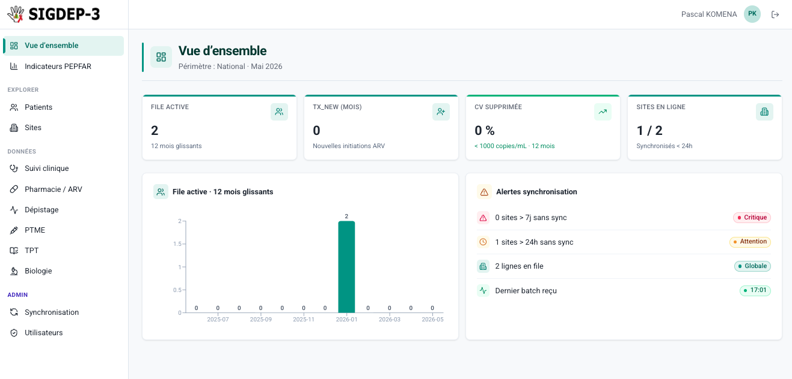

# sigdep-hub

Serveur central qui consolide les données de prise en charge VIH des
550+ sites SIGDEP-3 (Programme National de Lutte contre le Sida, Côte
d'Ivoire). Il reçoit les lots de synchronisation envoyés par les
agents installés sur chaque site, les stocke dans une seule base
PostgreSQL, calcule les indicateurs PEPFAR et nationaux, et sert une
console React aux utilisateurs national / régional / district / site.



## Place dans la plateforme SIGDEP-3

Ce dépôt est l'un des trois projets qui composent SIGDEP-3 :

| Projet                                                             | Rôle                                                                      |
| ------------------------------------------------------------------ | ------------------------------------------------------------------------- |
| [`sigdep-contracts`](https://github.com/ITECH-CI/sigdep-contracts) | Bibliothèque Maven : DTOs et contrats d'API partagés                      |
| [`sigdep-sync`](https://github.com/ITECH-CI/sigdep-sync)           | Agent côté site — lit OpenMRS local, pousse les lots                      |
| **`sigdep-hub`** (ce dépôt)                                        | Serveur central — réception des lots, indicateurs, console                |

L'agent installé sur chaque site lit la base OpenMRS MySQL locale,
transforme les enregistrements en DTOs canoniques définis dans
`sigdep-contracts`, et les POST à l'`ingestion-api` du hub. Le
`console-api` sert ensuite les indicateurs et listings aux
utilisateurs authentifiés via le SPA React.

```
   ┌──────────────────┐                  ┌────────────── sigdep-hub ───────────────┐
   │  OpenMRS du site │                  │                                          │
   │  (MySQL, lecture)│                  │   ingestion-api ──┐                      │
   └────────┬─────────┘                  │                   ▼                      │
            │   agent sigdep-sync        │            PostgreSQL                    │
            │   (Java, tampon SQLite)    │                   ▲                      │
            └──── lots HTTPS ────────────┼───►  console-api ─┘──► console React     │
                                         └──────────────────────────────────────────┘
```

## Modules

| Module          | Description                                                                  |
| --------------- | ---------------------------------------------------------------------------- |
| `core-domain`   | Entités JPA, repositories, services métier. Bibliothèque, pas de `main()`.   |
| `ingestion-api` | Application Spring Boot sur le port `8090`. Reçoit les lots des agents.      |
| `console-api`   | Application Spring Boot sur le port `8041`. Endpoints console + service SPA. |
| `console-web`   | Front React 18 + Vite + Tailwind.                                            |
| `infra/`        | docker-compose dev et prod, configs nginx, realm Keycloak.                   |

Les migrations Liquibase sont portées par `ingestion-api` (seul
écrivain) ; la console tourne avec `spring.liquibase.enabled=false`.

## Quickstart (dev)

Pré-requis : **JDK 17+**, **Maven 3.9+**, **Node 20+**, **Docker**
avec Compose v2. Toute la stack fonctionne en local sur un laptop.

```bash
# 1. Compiler les contrats (dépôt voisin) dans ~/.m2
git clone https://github.com/ITECH-CI/sigdep-contracts
cd sigdep-contracts && mvn -DskipTests install && cd ..

# 2. Cloner et compiler le hub
git clone https://github.com/ITECH-CI/sigdep-hub
cd sigdep-hub
mvn -DskipTests install

# 3. Démarrer l'infra (Postgres + Keycloak + nginx)
cd infra && docker compose up -d && cd ..

# 4. Appliquer le userprofile Keycloak (à faire une fois, après import du realm)
docker exec sigdep-keycloak /opt/keycloak/bin/kcadm.sh config credentials \
  --server http://localhost:8080 --realm master --user admin --password admin
docker cp infra/keycloak/extras/userprofile-sigdep.json \
  sigdep-keycloak:/tmp/userprofile-sigdep.json
docker exec sigdep-keycloak /opt/keycloak/bin/kcadm.sh update users/profile \
  -r sigdep -f /tmp/userprofile-sigdep.json

# 5. Lancer les trois processus (trois terminaux)
cp ingestion-api/.env.example ingestion-api/.env
cp console-api/.env.example   console-api/.env

(cd ingestion-api && ./run.sh --dev)             # port 8090, applique Liquibase
(cd console-api    && ./run.sh --dev)            # port 8041
(cd console-web    && npm install && npm run dev) # port 5173 (passe par nginx)
```

Ouvrir **http://localhost:9000** dans le navigateur. Comptes par
défaut :

| Identifiant       | Mot de passe | Rôles                                        |
| ----------------- | ------------ | -------------------------------------------- |
| `pkomena`         | `sigdep`     | `SUPER_ADMIN`, `IT_ADMIN`, `NATIONAL_VIEWER` |
| `national-viewer` | `sigdep`     | `NATIONAL_VIEWER`                            |
| `site-user`       | `sigdep`     | `SITE_USER` (nécessite un attribut `siteId`) |

| Composant                       | Port | Notes                                                |
| ------------------------------- | ---- | ---------------------------------------------------- |
| nginx (point d'entrée)          | 9000 | Origin unique pour toute la stack                    |
| Vite dev server (HMR)           | 5173 | Atteint via le proxy nginx                           |
| console-api                     | 8041 | Spring Boot                                          |
| ingestion-api                   | 8090 | Spring Boot, porteur du changelog Liquibase          |
| Keycloak (admin direct uniquement) | 8180 | Le trafic courant passe par nginx sur :9000        |
| Postgres                        | 5436 | Base `sigdep`, utilisateur `sigdep`/`sigdep`         |

## Documentation

### Pour les déployeurs et les utilisateurs

Le guide utilisateur, organisé par rôle, vit dans
[`docs/user-guide/`](docs/user-guide/README.md). Entrées les plus
utiles pour un pilote :

- [Installer le hub](docs/user-guide/deploiement/installer-hub.md) —
  procédure pas-à-pas pour la stack centrale.
- [Installer un agent](docs/user-guide/deploiement/installer-agent.md) —
  3 modes (systemd, Docker, Windows WinSW).
- [Checklist de déploiement pilote](docs/user-guide/deploiement/pilote-checklist.md) —
  tracker à cocher pour passer en production sur N sites.

### Pour les développeurs

- [docs/ARCHITECTURE.md](docs/ARCHITECTURE.md) — topologie des modules,
  modèle d'auth (JWT + AuthScope), règles de geo-scoping, calcul des
  indicateurs.
- [docs/OPERATIONS.md](docs/OPERATIONS.md) — commandes du quotidien
  (kcadm, Liquibase, run.sh), dépannage des problèmes rencontrés en
  développement (CORS, attributs utilisateur, dev profile, …).
- [docs/DEPLOYMENT.md](docs/DEPLOYMENT.md) — notes d'installation
  historiques basées sur `infra/docker-compose.prod.yml`. Pour un
  déploiement réel aujourd'hui, suivre plutôt
  [Installer le hub](docs/user-guide/deploiement/installer-hub.md)
  qui reflète le flux GHCR.
- [CONTRIBUTING.md](CONTRIBUTING.md) — workflow git, conventions de
  commit, style de code.
- [infra/keycloak/README.md](infra/keycloak/README.md) — import du
  realm, attributs user-profile, snippets kcadm.sh.

## Images de conteneurs

Chaque tag `v*.*.*` déclenche un workflow de release qui publie trois
images sur GHCR :

```
ghcr.io/<owner>/sigdep-ingestion-api:<version>
ghcr.io/<owner>/sigdep-console-api:<version>
ghcr.io/<owner>/sigdep-console-web:<version>
```

`<owner>` correspond par défaut au compte GitHub qui exécute la
release ; la variable de repo `IMAGE_REGISTRY` permet de surcharger
(par exemple `ghcr.io/itech-ci`). Ce sont les tags consommés par le
docker-compose de production — voir
[Installer le hub](docs/user-guide/deploiement/installer-hub.md).

## Licence

À définir en session plénière avec le HMIS TWG ; aucun fichier de
licence n'est livré pour l'instant. En attendant, considérer le
contenu comme « tous droits réservés par I-TECH Côte d'Ivoire et le
programme PNLS ».
